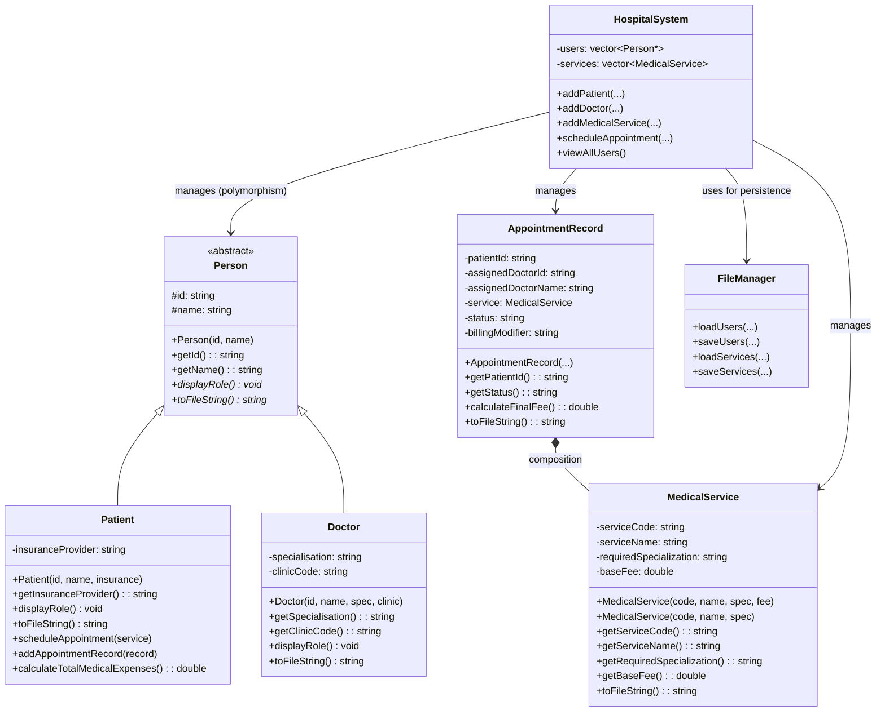
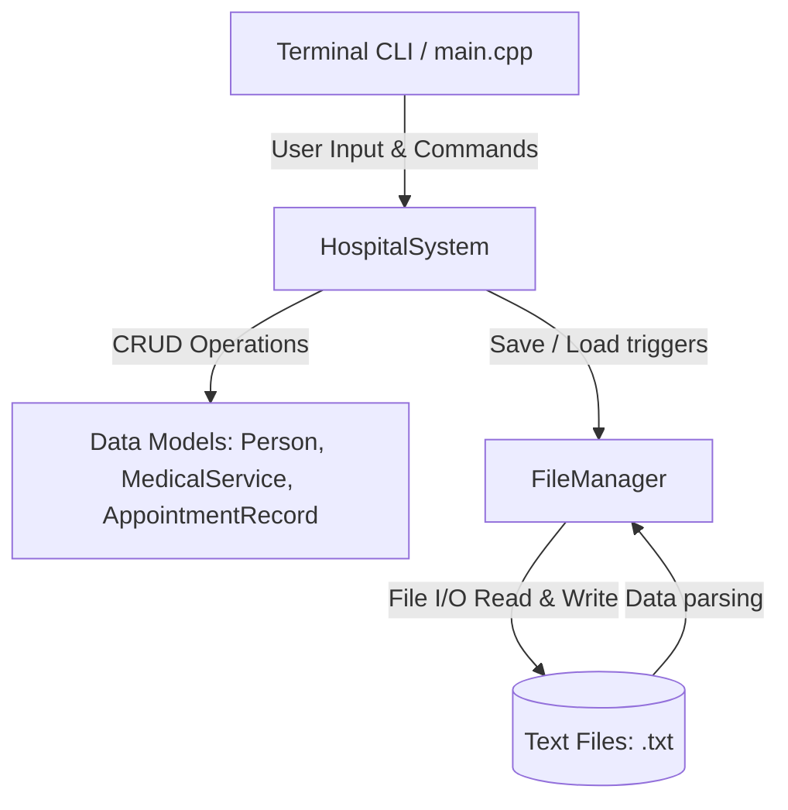
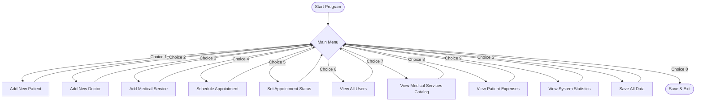

# Hospital Patient & Appointment Management System (HPAMS)

[](https://isocpp.org/)
[](https://opensource.org/licenses/MIT)
[](#)

## 📖 Project Overview
The **Hospital Patient and Appointment Management System (HPAMS)** is a robust, console-based enterprise application built entirely in **C++17**. It demonstrates advanced **Object-Oriented Programming (OOP)** paradigms and modern software engineering practices.

Designed to eliminate administrative inefficiencies in healthcare workflows, HPAMS automates the tracking of patient records, dynamic billing, medical service directories, and cross-department scheduling.

### 🛠️ Technology Stack & Core Competencies
- **Language:** C++17
- **Standard Library:** Heavy integration of STL (`std::vector`, `std::string`, `std::find_if`, `<algorithm>`, file streams)
- **Architecture:** Object-Oriented Design (Abstract Base Classes, Polymorphism, Encapsulation, Composition)
- **Error Handling:** Multi-tier custom exception propagation (`std::invalid_argument`, `std::runtime_error`)
- **Memory Management:** RAII, safe pointer handling via `std::vector` containment, and dynamic dispatch cleanup via Virtual Destructors.

---

## Build Instructions

### Prerequisites
- GCC with C++17 support (`g++ --version`)
- Windows: MinGW / MSYS2 or WSL

### Compile (one-liner)
```bash
cd app
g++ -std=c++17 -Wall -Wextra -I./include src/Person.cpp src/MedicalService.cpp src/AppointmentRecord.cpp src/Patient.cpp src/Doctor.cpp src/FileManager.cpp src/HospitalSystem.cpp src/main.cpp -o hospital_system
```

### Using Makefile (Linux/macOS/WSL)
```bash
cd app
make setup   # creates data/ folder and builds
make         # rebuild only
make clean   # remove binary
```

### Run
```bash
cd app
./hospital_system        # Linux / macOS / WSL
hospital_system.exe      # Windows CMD
```

---

## Getting Started: Comprehensive Demo Flow

This guide provides a comprehensive manual testing flow. Follow these steps to populate the system with multiple records, proving that all functionalities—including data persistence, polymorphism, static counts, and complex billing logic—work perfectly.

### 1. Starting the Application
Open your terminal (PowerShell) in the project directory and run the executable:
```powershell
cd app
.\hospital_system.exe
```

Upon starting, the application will display the welcome message and the main menu:

```text
  Welcome to the Hospital Patient & Appointment
  Management System (HPAMS)

=======================================================
       HOSPITAL MANAGEMENT SYSTEM MENU
=======================================================
  1. Add New Patient
  2. Add New Doctor
  3. Add New Medical Service
  4. Schedule Appointment for Patient
  5. Update Appointment & Process Billing
  6. View All Personnel and Patients
  7. View Medical Services Catalog
  8. View Patient Medical Expenses
  9. View System Dashboard
  S. Save All Data to Files
  0. Exit System
-------------------------------------------------------
  Enter choice: 
```

### 2. Comprehensive Data Entry Flow

Run through the following steps sequentially.

#### **Step A: Add Multiple Patients (Option 1)**
We will add two patients to test different insurance types.
1. Type `1` and press Enter.
   - `Enter Patient ID    :` `P001`
   - `Enter Patient Name  :` `Alice Tan`
   - `Enter Insurance     :` `AIA Gold`
2. Type `1` again.
   - `Enter Patient ID    :` `P002`
   - `Enter Patient Name  :` `Bob Lee`
   - `Enter Insurance     :` `Prudential`

#### **Step B: Add Multiple Doctors (Option 2)**
We will add two doctors across different specializations.
1. Type `2` and press Enter.
   - `Enter Doctor ID         :` `D001`
   - `Enter Doctor Name       :` `Dr. Smith`
   - `Enter Specialisation    :` `Cardiology`
   - `Enter Clinic Code       :` `C-101`
2. Type `2` again.
   - `Enter Doctor ID         :` `D002`
   - `Enter Doctor Name       :` `Dr. Adams`
   - `Enter Specialisation    :` `Neurology`
   - `Enter Clinic Code       :` `N-202`

#### **Step C: Add Multiple Medical Services (Option 3)**
We will add two distinct medical services.
1. Type `3` and press Enter.
   - `Enter Service Code  (e.g. SVC001) :` `SVC001`
   - `Enter Service Name               :` `Blood Test`
   - `Req. Specialization (e.g. General):` `Cardiology`
   - `Enter Base Fee in RM (leave blank for RM 50.00 default):` `150.00`
2. Type `3` again.
   - `Enter Service Code  (e.g. SVC001) :` `SVC002`
   - `Enter Service Name               :` `MRI Scan`
   - `Req. Specialization (e.g. General):` `Neurology`
   - `Enter Base Fee in RM (leave blank for RM 50.00 default):` `800.00`

#### **Step D: Schedule Appointments (Option 4)**
We will assign multiple services to different patients.
1. Type `4` and press Enter.
   - `--- Select Patient ---`
   - `Enter Patient ID     :` `P001`
   - `--- Select Medical Service ---`
   - `Enter Service Code   :` `SVC001`
   - `--- Select Doctor for Cardiology ---`
   - `Enter Doctor ID      :` `D001`
2. Type `4` again.
   - `--- Select Patient ---`
   - `Enter Patient ID     :` `P002`
   - `--- Select Medical Service ---`
   - `Enter Service Code   :` `SVC002`
   - `--- Select Doctor for Neurology ---`
   - `Enter Doctor ID      :` `D002`
3. Type `4` again.
   - `--- Select Patient ---`
   - `Enter Patient ID     :` `P001`
   - `--- Select Medical Service ---`
   - `Enter Service Code   :` `SVC002` (Alice takes two services)
   - `--- Select Doctor for Neurology ---`
   - `Enter Doctor ID      :` `D002`

#### **Step E: Update Appointment Status & Billing (Option 5)**
We will test standard, emergency, and cancelled billing modifiers.
1. Type `5` and press Enter.
   - `--- Select Patient ---`
   - `Enter Patient ID    :` `P001`
   - `--- Select Medical Service to Update ---`
   - `Enter Service Code  :` `SVC001`
   - `--- Enter New Status and Billing Details ---`
   - `Status [Scheduled/Completed/Cancelled/Emergency] :` `Completed`
   - `Billing [Standard/Insured/Emergency]             :` `Insured`
2. Type `5` again.
   - `--- Select Patient ---`
   - `Enter Patient ID    :` `P002`
   - `--- Select Medical Service to Update ---`
   - `Enter Service Code  :` `SVC002`
   - `--- Enter New Status and Billing Details ---`
   - `Status [Scheduled/Completed/Cancelled/Emergency] :` `Emergency`
   - `Billing [Standard/Insured/Emergency]             :` `Emergency` (Tests the 1.5x fee multiplier)
3. Type `5` again.
   - `--- Select Patient ---`
   - `Enter Patient ID    :` `P001`
   - `--- Select Medical Service to Update ---`
   - `Enter Service Code  :` `SVC002`
   - `--- Enter New Status and Billing Details ---`
   - `Status [Scheduled/Completed/Cancelled/Emergency] :` `Cancelled`
   - `Billing [Standard/Insured/Emergency]             :` `Standard`

#### **Step F: View Output Information (Options 6, 7, 8, 9)**
These options prove the system dynamically processes data:
- Type `6` to **View All Personnel and Patients** (Will cleanly list Alice, Bob, Dr. Smith, and Dr. Adams using Polymorphism).
- Type `7` to **View Medical Services Catalog** (Will list Blood Test and MRI Scan).
- Type `8` to **View Patient Medical Expenses** for Alice.
   - `Enter Patient ID :` `P001` (Calculates bill for Completed Blood Test + Cancelled MRI).
- Type `8` again for Bob.
   - `Enter Patient ID :` `P002` (Calculates bill for the Emergency MRI with a 1.5x multiplier).
- Type `9` to **View System Dashboard** (Proves the static counters accurately read 2 Patients, 2 Doctors, 4 Users).

#### **Step G: Verify Persistence (Options S and 0)**
1. Type `S` to test manual data serialization (Proves `patients.txt`, `doctors.txt`, and `appointments.txt` populate).
2. Type `0` and press Enter to auto-save and exit gracefully.

*Tip: After exiting, check the `data/` folder and read the `.txt` files to confirm the data is there. When you run `.\hospital_system.exe` again, Options 6, 7, 8, and 9 will immediately load and display this data!*

---

## Project Structure

```
Hospital-Management-System/
├── app/
│   ├── include/              <- Header files (.h)
│   │   ├── Person.h
│   │   ├── Patient.h
│   │   ├── Doctor.h
│   │   ├── MedicalService.h
│   │   ├── AppointmentRecord.h
│   │   ├── HospitalSystem.h
│   │   └── FileManager.h
│   ├── src/                  <- Source files (.cpp)
│   │   ├── main.cpp
│   │   ├── Person.cpp
│   │   ├── Patient.cpp
│   │   ├── Doctor.cpp
│   │   ├── MedicalService.cpp
│   │   ├── AppointmentRecord.cpp
│   │   ├── HospitalSystem.cpp
│   │   └── FileManager.cpp
│   ├── data/                 <- Runtime data files (auto-created)
│   │   ├── patients.txt
│   │   ├── doctors.txt
│   │   ├── services.txt
│   │   └── appointments.txt
│   └── Makefile
└── README.md
```

---

## OOP Concepts Demonstrated

| Concept | Where |
|---------|-------|
| Abstract Base Class | `Person` — `displayRole()` pure virtual |
| Inheritance | `Patient`, `Doctor` inherit `Person` |
| Runtime Polymorphism | `viewAllUsers()` — `vector<Person*>` |
| Constructor Overloading | `MedicalService` — 2 constructors |
| Composition | `AppointmentRecord` HAS-A `MedicalService` |
| Static Members | `totalCount`, `patientCount`, `doctorCount` |
| STL | `vector`, `string`, `find_if`, `fstream` |
| Exception Handling | `try/catch` across all menu handlers |
| Memory Safety | `delete` in `~HospitalSystem()` |

---

## Diagrams

### 1. UML Class Diagram



### 2. System Architecture



### 3. User Flow Diagram



### 4. VTable (Dynamic Dispatch) Diagram

```mermaid
flowchart LR
    subgraph Vectors
        users["vector&lt;Person*&gt; users"]
    end

    subgraph Memory Heap
        P1["Patient Object\n- id: P001\n- __vptr"]
        D1["Doctor Object\n- id: D001\n- __vptr"]
    end

    subgraph Virtual Tables
        VT_P["Patient vtable\n1. Patient::~Patient()\n2. Patient::displayRole()"]
        VT_D["Doctor vtable\n1. Doctor::~Doctor()\n2. Doctor::displayRole()"]
    end

    users -->|users[0]| P1
    users -->|users[1]| D1

    P1 -->|__vptr| VT_P
    D1 -->|__vptr| VT_D
```
