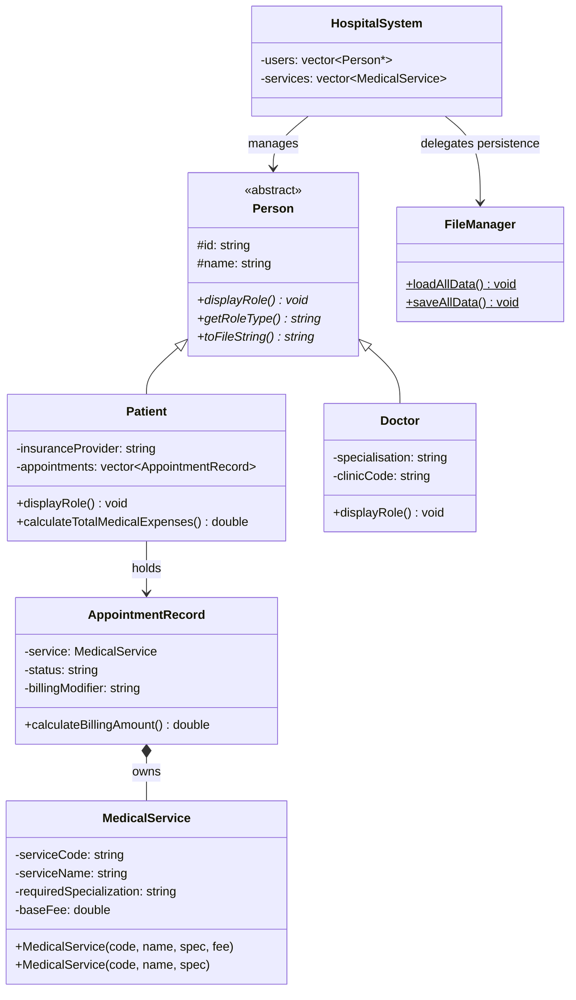

# Hospital Patient & Appointment Management System

[](https://isocpp.org/)
[](https://gcc.gnu.org/)
[](#)
[](https://opensource.org/licenses/MIT)

A console-based hospital administration system built in **C++17**, demonstrating enterprise-grade Object-Oriented Programming: abstract class hierarchies, runtime polymorphism via virtual dispatch, STL data structures, and persistent file-backed storage.

---

## Features

- **Patient & Doctor Registry** — Register patients (with insurance info) and doctors (with specialization and clinic assignment)
- **Specialization-Enforced Scheduling** — Appointments are only bookable with a doctor whose specialization matches the service's required field
- **Dynamic Billing Engine** — Appointment fees adjust automatically: 20% discount for insured patients, 50% surcharge for emergency status, and zero-charge for cancellations
- **Medical Services Catalog** — Define services with required specializations and base fees; missing fees default to a system-wide standard
- **File Persistence** — Data is auto-loaded on startup and auto-saved on exit via a pipe-delimited flat-file format (`users.txt`, `services.txt`, `appointments.txt`)
- **System Dashboard** — O(1) live totals tracked by static counters across `Person`, `Patient`, and `Doctor` classes
- **Exception-Safe UI** — Four-tier catch hierarchy catches `invalid_argument`, `ios_base::failure`, `runtime_error`, and generic exceptions for clean recovery

---

## Architecture

```
┌──────────────────────────────────────────────────────────────────┐
│                     Terminal CLI (main.cpp)                      │
│               User I/O · Menu Loop · Exception Handling          │
└─────────────────────────────┬────────────────────────────────────┘
                              │
              ┌───────────────▼───────────────┐
              │         HospitalSystem         │
              │  CRUD · Scheduling · Reporting │
              └──┬──────────────┬─────────────┘
                 │              │
    ┌────────────▼────┐  ┌──────▼────────────┐
    │  Data Models    │  │    FileManager     │
    │  Person (abs)   │  │  (all static I/O)  │
    │  ├─ Patient     │  └──────────────────┬─┘
    │  └─ Doctor      │                     │
    │  MedicalService │              ┌───────▼────────┐
    │  Appointment    │              │  .txt flat files│
    │    Record       │              └────────────────┘
    └─────────────────┘
```

### OOP Design Highlights

| Concept | Implementation |
|---|---|
| Abstract Base Class | `Person` — `displayRole()`, `getRoleType()`, `toFileString()` are pure virtual |
| Inheritance | `Patient` and `Doctor` extend `Person` via public inheritance |
| Runtime Polymorphism | `std::vector<Person*>` iterates heterogeneous objects; `vptr` resolves the correct vtable entry at runtime |
| Virtual Destructor | Ensures derived-class destructors are called when deleting through base pointers |
| Compile-time Polymorphism | `MedicalService` provides two overloaded constructors (with/without explicit fee) |
| Composition | `AppointmentRecord` owns a `MedicalService` value — "has-a", not "is-a" |
| Static Members | `Person::totalCount`, `Patient::patientCount`, `Doctor::doctorCount` — O(1) system statistics |
| `dynamic_cast` | `findPatient()` / `findDoctor()` safely downcast from `Person*` to concrete types |
| STL | `std::vector`, `std::string`, `std::find_if` + lambda, `std::stringstream`, `<fstream>` |
| Exception Handling | Four-tier `try/catch` in `main.cpp` — specific diagnostics per failure category |

---

## Project Structure

```
Hospital-Management-System/
├── app/
│   ├── include/              # Header files — class declarations
│   │   ├── Person.h
│   │   ├── Patient.h
│   │   ├── Doctor.h
│   │   ├── MedicalService.h
│   │   ├── AppointmentRecord.h
│   │   ├── HospitalSystem.h
│   │   └── FileManager.h
│   ├── src/                  # Implementation files
│   │   ├── main.cpp
│   │   ├── Person.cpp
│   │   ├── Patient.cpp
│   │   ├── Doctor.cpp
│   │   ├── MedicalService.cpp
│   │   ├── AppointmentRecord.cpp
│   │   ├── HospitalSystem.cpp
│   │   └── FileManager.cpp
│   ├── data/                 # Auto-created at runtime
│   │   ├── users.txt
│   │   ├── services.txt
│   │   └── appointments.txt
│   └── Makefile
└── README.md
```

---

## Getting Started

### Prerequisites

| Tool | Minimum Version |
|---|---|
| GCC / G++ | 7.0+ (C++17 support) |
| MinGW / MSYS2 | Any (Windows) |
| GNU Make | 4.0+ (optional) |

### Build

**Using Makefile (recommended):**
```bash
cd app
make          # build
make setup    # create data/ directory and build
make clean    # remove binary
```

**Manual compile:**
```bash
cd app
g++ -std=c++17 -Wall -Wextra -I./include \
    src/Person.cpp src/MedicalService.cpp src/AppointmentRecord.cpp \
    src/Patient.cpp src/Doctor.cpp src/FileManager.cpp \
    src/HospitalSystem.cpp src/main.cpp \
    -o hospital_system
```

### Run

```bash
./hospital_system          # Linux / macOS / WSL
.\hospital_system.exe      # Windows PowerShell
```

---

## Usage Walkthrough

The system uses a numbered menu. A complete demo session follows.

**1. Register entities**

```
Enter choice: 1          → Add Patient  (ID: P001, Name: Alice Tan, Insurance: AIA Gold)
Enter choice: 2          → Add Doctor   (ID: D001, Name: Dr. Smith, Specialization: Cardiology)
Enter choice: 3          → Add Service  (Code: SVC001, Name: Blood Test, Spec: Cardiology, Fee: 150.00)
```

**2. Schedule an appointment**

```
Enter choice: 4
  Enter Patient ID   : P001
  Enter Service Code : SVC001
  Enter Doctor ID    : D001      ← only Cardiology doctors appear in the list
```

**3. Update status & billing**

```
Enter choice: 5
  Enter Patient ID   : P001
  Enter Service Code : SVC001
  Status  [Scheduled/Completed/Cancelled/Emergency] : Completed
  Billing [Standard/Insured/Emergency]              : Insured
```

> Insured billing applies a 20% discount. Emergency applies a 50% surcharge. Cancelled resets the charge to RM 0.00.

**4. View and persist data**

```
Enter choice: 6    → View all users       (runtime polymorphism in action)
Enter choice: 8    → View patient bill    (calculates all appointment totals)
Enter choice: 9    → System dashboard     (live static counters)
Enter choice: S    → Manual save to files
Enter choice: 0    → Auto-save and exit
```

---

## Class Diagram



---

## License

This project is licensed under the [MIT License](https://opensource.org/licenses/MIT).
