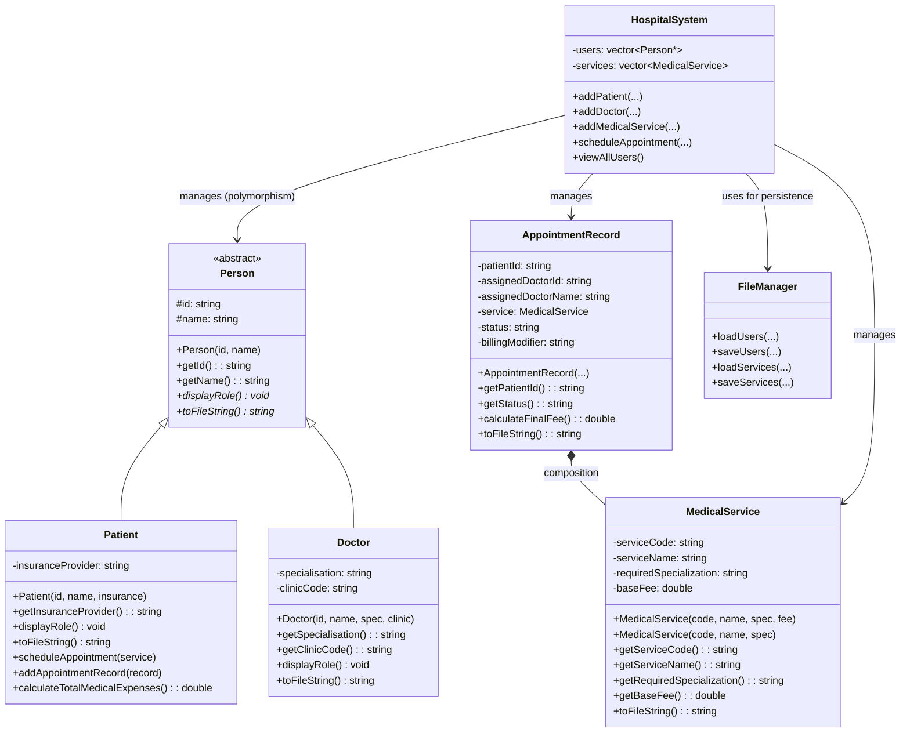
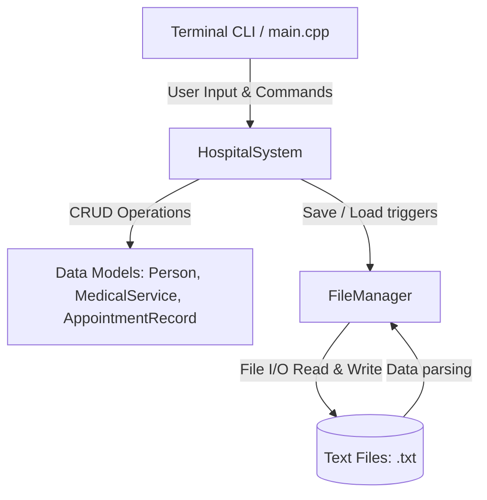
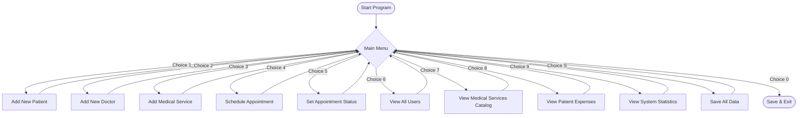

# Hospital Patient & Appointment Management System (HPAMS)
### CST209 — Object-Oriented Programming C++ | Xiamen University Malaysia 2026/04

**GitHub Repository:** [https://github.com/LouSens/Hospital-Management-System](https://github.com/LouSens/Hospital-Management-System)

---

## Build Instructions

### Prerequisites
- GCC with C++17 support (`g++ --version`)
- Windows: MinGW / MSYS2 or WSL

### Compile (one-liner)
```bash
g++ -std=c++17 -Wall -Wextra -I./include src/Person.cpp src/MedicalService.cpp src/AppointmentRecord.cpp src/Patient.cpp src/Doctor.cpp src/FileManager.cpp src/HospitalSystem.cpp src/main.cpp -o hospital_system
```

### Using Makefile (Linux/macOS/WSL)
```bash
make setup   # creates data/ folder and builds
make         # rebuild only
make clean   # remove binary
```

### Run
```bash
./hospital_system        # Linux / macOS / WSL
hospital_system.exe      # Windows CMD
```

---

## Project Structure

```
Hospital-Management-System/
├── include/              <- Header files (.h)
│   ├── Person.h
│   ├── Patient.h
│   ├── Doctor.h
│   ├── MedicalService.h
│   ├── AppointmentRecord.h
│   ├── HospitalSystem.h
│   └── FileManager.h
├── src/                  <- Source files (.cpp)
│   ├── main.cpp
│   ├── Person.cpp
│   ├── Patient.cpp
│   ├── Doctor.cpp
│   ├── MedicalService.cpp
│   ├── AppointmentRecord.cpp
│   ├── HospitalSystem.cpp
│   └── FileManager.cpp
├── data/                 <- Runtime data files (auto-created)
│   ├── patients.txt
│   ├── doctors.txt
│   ├── services.txt
│   └── appointments.txt
├── report/               <- Project report
│   └── report.docx
├── Makefile
└── README.md
```

---

## OOP Concepts Demonstrated

| Concept | Where |
|---------|-------|
| Abstract Base Class | `Person` — `displayRole()` pure virtual |
| Inheritance | `Patient`, `Doctor` inherit `Person` |
| Runtime Polymorphism | `viewAllUsers()` — `vector<Person*>` |
| Constructor Overloading | `MedicalService` — 2 constructors |
| Composition | `AppointmentRecord` HAS-A `MedicalService` |
| Static Members | `totalCount`, `patientCount`, `doctorCount` |
| STL | `vector`, `string`, `find_if`, `fstream` |
| Exception Handling | `try/catch` across all menu handlers |
| Memory Safety | `delete` in `~HospitalSystem()` |

---

## Diagrams

### 1. UML Class Diagram



### 2. System Architecture



### 3. User Flow Diagram



### 4. VTable (Dynamic Dispatch) Diagram

```mermaid
flowchart LR
    subgraph Vectors
        users["vector&lt;Person*&gt; users"]
    end

    subgraph Memory Heap
        P1["Patient Object\n- id: P001\n- __vptr"]
        D1["Doctor Object\n- id: D001\n- __vptr"]
    end

    subgraph Virtual Tables
        VT_P["Patient vtable\n1. Patient::~Patient()\n2. Patient::displayRole()"]
        VT_D["Doctor vtable\n1. Doctor::~Doctor()\n2. Doctor::displayRole()"]
    end

    users -->|users[0]| P1
    users -->|users[1]| D1

    P1 -->|__vptr| VT_P
    D1 -->|__vptr| VT_D
```
